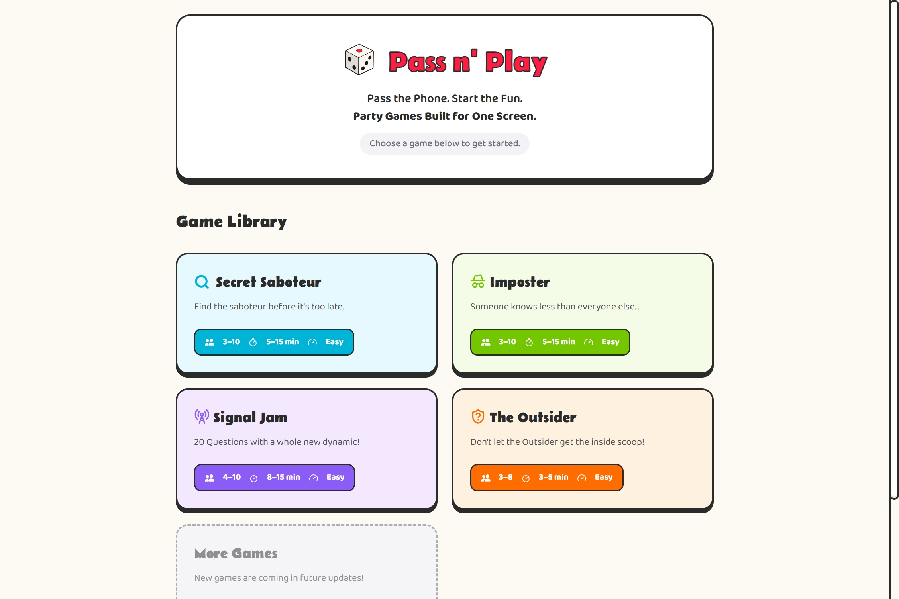
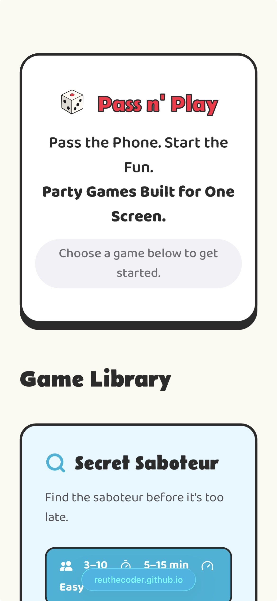

# Pass n' Play

A one-device party game hub in which players pass a single device around the table and play social deduction games for all ages with no app download, no accounts, and no second screen required.

<p align="center">
   
   
</p>

Quick Start:

[](https://reuthecoder.github.io/pass-n-play/) 

## Site Features

- **Four social deduction games:** [*Secret Saboteur, Imposter, Signal Jam* and *The Outsider*], each with its own rules, roles, and win conditions, built around a single shared device passed between players
- **Guided "Pass and Play" flow:** As indicated by the game, each game is designed to only require one screen. For instance, each game has a tap-to-reveal flip card shows each player their private role, then requires the card to be flipped back face-down before the "Next" button unlocks, preventing accidental reveals to the next player
- **Configurable round timers:** Games like Signal Jam and Imposter feature a timer with an on/off toggle and adjustable duration as well as an audio alarm when time expires
- **Custom word content per game:** Signal Jam gets its fun from a rotating word bank per round, and The Outsider uses themed 4×4 word grids ("Phobias," "Authors," etc) with a different secret word selected each playthrough
- **Auto-rotating landscape grid:** The Outsider's word-grid screen automatically rotates 90° on narrow phones the layout so the group can lay the phone flat on the table and read it without cramming a 4×4 grid into a portrait strip
- **Saved party system:** Player name groups can be saved to the browser via `localStorage` and loaded into the player name step of any game with one tap, so a regular group doesn't have to retype names every session
- **Consistent, from-scratch design system:** Each game shares a neo-brutalist inspired visual language implemented in plain CSS across all four games and the info/library pages, with no UI framework

## How It Works

The whole site is built in vanilla HTML, CSS, and JavaScript. Using this setup, I was able to create a deliberate system in which each game is a self contained with a `index.html` + `script.js` + `style.css` file and a shared `game.css` for the design system used everywhere. New games get built by copying the reusable pieces from an existing game's programming (for example, I would often copy my setup screen, flip-card role reveal, suspect-voting grid, results screen for each game's HTML), rather than trying to connect a bunch of different components. With only four games, the copy-and-revise approach stayed faster and easier to reason about than building a shared game engine prematurely.

A tricky piece during the building process was The Outsider's word-grid screen, which needed to rotate into landscape on narrow phones without ever producing scroll. Rather than lock screen orientation (unreliably supported across browsers) or create a second layout, the screen's content is rotated 90° with a CSS transform and re-sized against the *viewport's* height instead of its width, so what was a tall, narrow portrait screen becomes a wide, short landscape strip with no dead space. The grid then stretches to fill exactly what's left over using flexbox, rather than fixed pixel math, so it holds up across different phone sizes.

## How to Run Locally

This site has no system dependencies, requires no runtime installation commands (like npm or yarn), and uses browser `localStorage` instead of external environment variables.

1. **Clone the repository:**
   ```bash
   git clone https://github.com/ReuTheCoder/pass-n-play.git
   ```
2. **Open the project folder:**
   ```bash
   cd pass-n-play
   ```
3. **Launch the site:**
- Double-click the `index.html` file in your file explorer to open it in any modern web browser. 
**OR** 
- Using VS Code, open the project and click **Go Live** via the Live Server extension to run a local development server at `http://127.0.0.1:5500`.

## Credits / Acknowledgements

This project was made as a submission to [HackClub's Stardance Challenge](https://stardance.hackclub.com/)  Thank you to Hackclub for motivating me to make this project!

favicon.io" was used for making the favicon. Icons were sourced from [Lucide Icons](https://lucide.dev/icons/) and [Bootstrap Icons](https://icons.getbootstrap.com/?q=x). Any audio was taken from ttsmp3.com or Pixabay and was confirmed to not require attribution for non-commercial products. The fonts used were [Baloo Da 2](https://fonts.google.com/specimen/Baloo+2) and [Belanosima](https://fonts.google.com/specimen/Belanosima) via Google Fonts.

- Secret Saboteur is inspired by Rabble's *Bot or Not* card game
- Signal Jam is inspired by Bézier Games' *Werewords*
- The Outsider is inspired by Big Potato Games' *The Chameleon*

### AI Usage
This project was built with help from primarily Google's Gemini, OpenAI's ChatGPT and sometimes Anthropic's Claude. Gemini was used for general coding queries, UI/UX design feedback and CSS debugging. OpenAI was used for brainstorming, formulating inital word/prompt banks and general debugging. Claude was used for game logic help across all four games. 

All game rules, content, and final design decisions are my own, I tried to indicate in the comments of my code whenever a portion has heavily assisted by AI. When debugging, I attempted to solve an issue first before consulting AI. Instead of asking AI to build entire sections of my project, I only used it to clarify specific syntax questions and then worked through the implementation on my own. 


